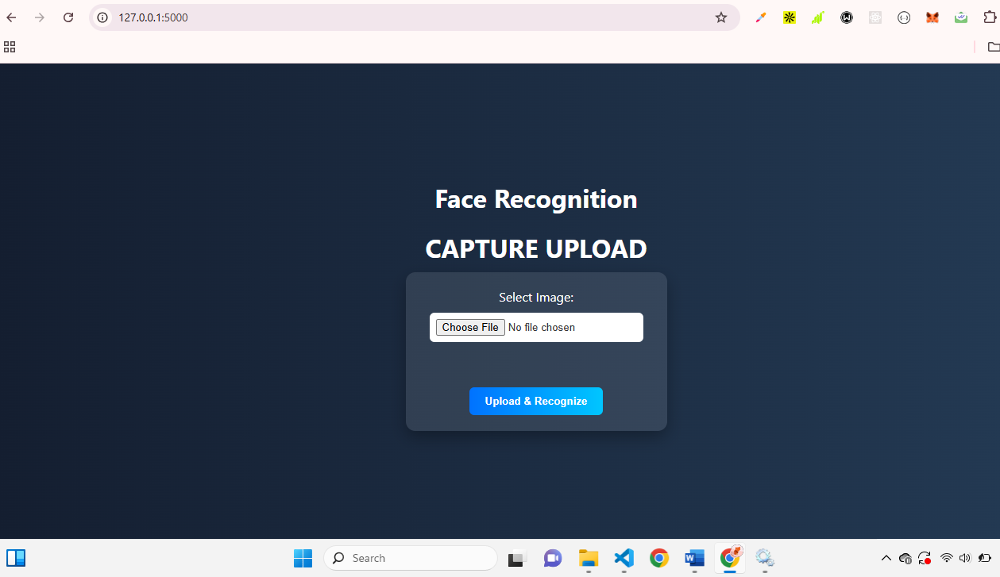

# AI-Driven Facial Recognition System using Mathematical Feature Extraction



This is a Flask-based facial recognition system that integrates **AI-driven models** with **mathematical feature extraction techniques** like **Principal Component Analysis (PCA)** and **Linear Discriminant Analysis (LDA)** to identify faces with high accuracy and performance.

> **Project Type:** Research Thesis  
> **Tech Stack:** Python · Flask · PCA · LDA · CNN · SVM · MongoDB


---

##  Features

- Image Capture & Upload
- Facial Preprocessing
- PCA & LDA Feature Extraction
- CNN Model for Deep Feature Learning
- SVM Classifier for Identity Prediction
- Admin Local Server Dashboard for User Upload
- MongoDB/NoSQL Database Integration
- Confidence Score & Identity Verification

---


## 🔧 System Requirements

###  Hardware
- Intel i5/i7 or AMD Ryzen
- RAM: 8GB+ (16GB Recommended)
- GPU: NVIDIA GTX 1050 or better (optional for training CNN)

###  Software
- OS: Windows 10/11, MacOS or Ubuntu Linux
- Python 3.8+
- MongoDB or PostgreSQL

---

## ⚙️ Installation Guide

### 1. Clone the Repository and Set Up Environment

```bash
# Clone the repository
git clone https://github.com/0xSettings/AI-Facial-Recognition-Using-Math-Feature.git
cd ai-facial-recognition-using-math-feature

# Create virtual environment
python -m venv venv

# Activate virtual environment
source venv/bin/activate       # For Linux/Mac
venv\Scripts\activate          # For Windows 

# Install all needed dependencies
pip install -r require.txt

# Start MongoDB service
sudo service mongod start      # For Linux/WIndows Powershell user


# Run app
python app.py

# 
# http://127.0.0.1:5000
